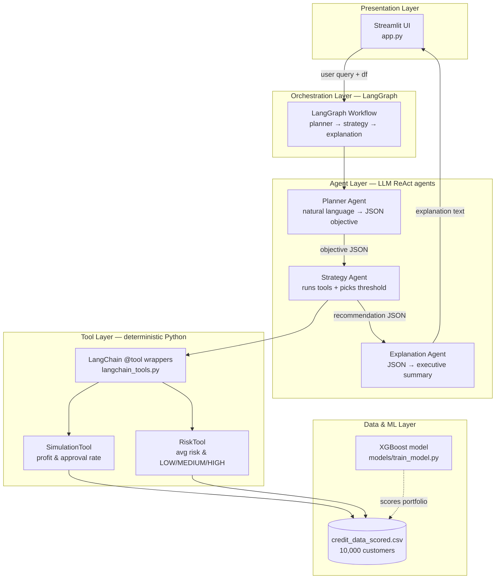
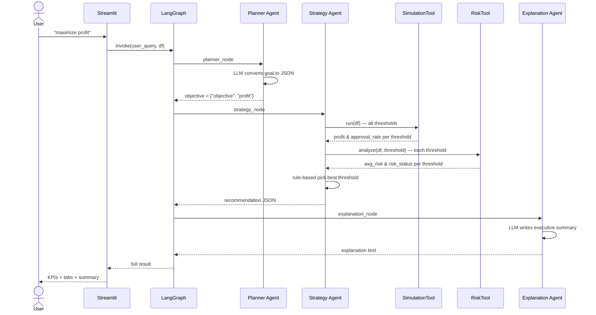

# AI-Powered Credit Policy Decision Simulator

**One-line description:** A multi-agent AI system that simulates changes in loan approval policies and predicts their impact on approval rate, default risk, and revenue — with explainable recommendations in natural language.

---

## Problem Statement

Banks typically use **fixed credit approval rules**.

**Example:** Approve a loan only if credit score > 700.

Business teams often ask:

- Can we approve more customers?
- Can we increase revenue?
- What happens if we relax approval criteria?
- What is the best balance between growth and risk?

**Current ML systems** usually only predict:

> Will this customer default?

They **cannot** answer:

> What happens if we **change the policy**?

### Goal

Build an AI system that:

1. **Simulates** policy changes (different approval thresholds)
2. **Predicts** business impact (approval rate, profit, risk)
3. **Recommends** an optimal policy threshold
4. **Explains** the decision in plain language for executives

### How this project solves it

| Traditional ML | This system |
|----------------|-------------|
| Predicts default per customer | Simulates portfolio impact at different thresholds |
| Single score output | Compares 8 policy scenarios (thresholds 0.1–0.8) |
| No business language | Planner + Explanation agents interpret goals and summarize results |
| Fixed rule | Strategy agent picks the best threshold for the stated objective |

**Policy lever used in this project:**  
Approve customers where `predicted_default_probability < threshold`  
(threshold is tuned from 0.1 to 0.8)

---

## Architecture



### Layer summary

| Layer | Files | Role |
|-------|-------|------|
| UI | `app.py` | User enters business goal, sees KPIs and tabs |
| Orchestration | `workflow/langgraph_workflow.py`, `nodes.py`, `state.py` | Runs agents in order, passes shared state |
| Agents | `agents/planner_agent.py`, `strategy_agent.py`, `explanation_agent.py` | LLM-powered reasoning (Groq / Llama 3.3 70B) |
| Tools | `tools/simulation_tool.py`, `risk_tool.py`, `langchain_tools.py` | Deterministic calculations the agents use |
| Data / ML | `datasets/`, `models/train_model.py` | Scored customer portfolio |

---

## End-to-end flow



### Step-by-step (what happens when you click **Run analysis**)

| Step | Node | Input | Output |
|------|------|-------|--------|
| 1 | **Planner** | `"maximize profit"` | `{"objective": "profit"}` |
| 2 | **Strategy** | objective + dataframe | Runs simulation & risk tools, picks threshold |
| 3 | **Explanation** | recommendation JSON | Plain-English paragraph for executives |

---

## Agents vs tools — what is what?

| | **Agent** | **Tool** |
|--|-----------|----------|
| **Brain** | LLM (Groq) | Pure Python |
| **Job** | Interpret, decide, explain | Calculate numbers |
| **Who calls it** | LangGraph workflow | Strategy agent (inside `decide()`) |
| **Deterministic?** | Planner/Explanation: mostly; Strategy: yes (rules) | Always yes |

**Agent** = understands language and produces judgments or text.  
**Tool** = runs formulas on data; same input always gives same output.

---

## Agents (detailed)

### 1. Planner Agent
**File:** `agents/planner_agent.py`  
**Type:** LangGraph ReAct agent (LLM only, no tools)

**Job:** Convert a vague business question into structured JSON the system can act on.

**Example input → output:**

| User query | Planner output |
|------------|----------------|
| `"maximize profit"` | `{"objective": "profit"}` |
| `"reduce risk"` | `{"objective": "risk"}` |
| `"increase approvals"` | `{"objective": "approval_rate"}` |
| `"increase approvals but keep risk moderate"` | `{"objectives": [{"objective": "approval_rate"}, {"objective": "risk", "target": "moderate"}]}` |

---

### 2. Strategy Agent
**File:** `agents/strategy_agent.py`  
**Type:** Uses tools internally + rule-based selection

**Job:**
1. Call **SimulationTool** and **RiskTool** on the portfolio
2. Merge results for each threshold (0.1 – 0.8)
3. Pick the best threshold based on the planner’s objective

**Selection rules:**

| Objective | Rule | Typical threshold |
|-----------|------|-------------------|
| `profit` | Highest profit | **0.5** |
| `risk` | Lowest avg_risk | **0.1** |
| `approval_rate` | Highest approval_rate | **0.8** |
| approval + risk (compound) | Highest approval among **MEDIUM** risk | **0.7** |

**Example input → output:**

```
Input objective: {"objective": "profit"}

Tool outputs (simplified):
  threshold 0.5 → profit $292M, approval 56.76%, risk MEDIUM
  threshold 0.8 → profit $210M, approval 83.64%, risk HIGH

Strategy output:
{
  "threshold": 0.5,
  "approval_rate": 56.76,
  "profit": 292684229.22,
  "avg_risk": 0.2141,
  "risk_status": "MEDIUM"
}
```

> **Note:** `decide()` uses tools + rules (reliable). `decide_react()` lets the LLM call tools directly (experimental, less reliable).

---

### 3. Explanation Agent
**File:** `agents/explanation_agent.py`  
**Type:** LangGraph ReAct agent with one tool (`parse_recommendation`)

**Job:** Turn the strategy JSON into a short executive summary.

**Example input → output:**

```
Input recommendation:
{"threshold": 0.1, "approval_rate": 15.68, "profit": 118629818.16,
 "avg_risk": 0.0582, "risk_status": "LOW"}

Output (summary):
"We recommend a conservative approval threshold of 0.1. Only 15.68% of
customers would be approved, but portfolio risk is LOW with expected
profit of approximately $118.6M. This policy prioritizes risk reduction
over growth."
```

---

## Tools (detailed)

### 1. SimulationTool
**File:** `tools/simulation_tool.py`  
**LangChain wrapper:** `run_credit_simulation` in `tools/langchain_tools.py`

**Job:** For each threshold 0.1–0.8, simulate portfolio outcomes.

**Policy rule:**
```
Approve if predicted_default_probability < threshold
```

**Formulas:**
```
revenue        = sum(loan_amount × 15% interest) for approved customers
expected_loss  = sum(default_prob × loan_amount × 30% LGD) for approved
profit         = revenue − expected_loss
approval_rate  = approved_count / total_customers × 100
```

**Example output (one row):**
```json
{"threshold": 0.5, "approval_rate": 56.76, "profit": 292684229.22}
```

---

### 2. RiskTool
**File:** `tools/risk_tool.py`  
**LangChain wrappers:** `analyze_portfolio_risk`, `analyze_all_threshold_risks`

**Job:** Measure risk among approved customers at a given threshold.

**Formulas:**
```
avg_risk = mean(predicted_default_probability) for approved customers

risk_status:
  avg_risk < 0.20  → LOW
  avg_risk < 0.35  → MEDIUM
  else             → HIGH
```

**Example output:**
```json
{"threshold": 0.5, "avg_risk": 0.2141, "risk_status": "MEDIUM"}
```

---

### 3. LangChain tool wrappers
**File:** `tools/langchain_tools.py`

Wraps SimulationTool and RiskTool with `@tool` so the LLM can discover and invoke them (name, description, input schema).

| Tool name | Parameters | Description |
|-----------|------------|-------------|
| `run_credit_simulation` | none | Profit & approval for all thresholds |
| `analyze_portfolio_risk` | `threshold: float` | Risk at one threshold |
| `analyze_all_threshold_risks` | none | Risk for all thresholds |

---

## Full walkthrough — one query end to end

**User query:** `"reduce risk"`

```
┌─────────────────────────────────────────────────────────────┐
│ 1. PLANNER AGENT                                            │
│    Input:  "reduce risk"                                    │
│    Output: {"objective": "risk"}                            │
└────────────────────────────┬────────────────────────────────┘
                             ▼
┌─────────────────────────────────────────────────────────────┐
│ 2. STRATEGY AGENT                                           │
│    SimulationTool → 8 rows (threshold, profit, approval)    │
│    RiskTool       → 8 rows (threshold, avg_risk, status)    │
│    Rule: pick lowest avg_risk                               │
│    Output: threshold 0.1, approval 15.68%, profit $118M,    │
│            avg_risk 0.0582, risk_status LOW                 │
└────────────────────────────┬────────────────────────────────┘
                             ▼
┌─────────────────────────────────────────────────────────────┐
│ 3. EXPLANATION AGENT                                        │
│    Input:  recommendation JSON above                        │
│    Output: Executive paragraph explaining tradeoff          │
└─────────────────────────────────────────────────────────────┘
```

---

## Threshold comparison table (reference)

From `datasets/credit_data_scored.csv` (10,000 customers):

| Threshold | Approval rate | Profit | Avg risk | Risk status | Best for |
|-----------|---------------|--------|----------|-------------|----------|
| 0.1 | 15.68% | $118.6M | 0.058 | LOW | Reduce risk |
| 0.5 | 56.76% | $292.7M | 0.214 | MEDIUM | Maximize profit |
| 0.7 | 73.91% | $258.9M | 0.305 | MEDIUM | Approvals + moderate risk |
| 0.8 | 83.64% | $210.8M | 0.357 | HIGH | Maximize approvals |

---

## Project structure

```
credit-policy-simulator-ai/
├── app.py                      # Streamlit UI (main entry)
├── requirements.txt
├── test_strategy_quick.py      # Quick test for 4 preset queries
├── PROJECT.md                  # This document
│
├── agents/
│   ├── planner_agent.py        # Goal → JSON objective
│   ├── strategy_agent.py       # Tools + threshold selection
│   ├── explanation_agent.py    # JSON → executive summary
│   └── agent_utils.py          # Shared helpers
│
├── tools/
│   ├── simulation_tool.py      # Profit & approval simulation
│   ├── risk_tool.py            # Risk metrics per threshold
│   └── langchain_tools.py      # @tool wrappers for LLM
│
├── workflow/
│   ├── langgraph_workflow.py   # Graph definition + CLI runner
│   ├── nodes.py                # planner / strategy / explanation nodes
│   └── state.py                # Shared state TypedDict
│
├── models/
│   ├── train_model.py          # Train XGBoost, score dataset
│   └── threshold.txt           # Model threshold artifact
│
├── datasets/
│   └── credit_data_scored.csv  # Portfolio with default probabilities
└── data/                       # Raw data & EDA scripts
```

---

## How to run

```powershell
# Setup
cd credit-policy-simulator-ai
.\venv\Scripts\Activate.ps1
pip install -r requirements.txt

# Add GROQ_API_KEY to .env

# Streamlit UI
streamlit run app.py

# CLI (LangGraph)
python workflow/langgraph_workflow.py

# Quick test (4 queries)
python test_strategy_quick.py
```

---

## Tech stack

| Component | Technology |
|-----------|------------|
| UI | Streamlit |
| Orchestration | LangGraph |
| Agents | LangChain ReAct + Groq (Llama 3.3 70B) |
| Tools | LangChain `@tool` + pandas |
| Risk model | XGBoost (`models/train_model.py`) |
| Data | CSV portfolio (10K customers) |

---

## Key concepts to remember

1. **Policy = threshold on default probability** — lower threshold = stricter, higher = more approvals.
2. **Agents think in language; tools compute numbers** — never ask the LLM to do math across 10K rows.
3. **LangGraph wires the pipeline** — planner → strategy → explanation, with shared state.
4. **Strategy is deterministic** — tools fetch data, rules pick the threshold (consistent results).
5. **ML scores customers; simulation scores policies** — XGBoost predicts default prob; SimulationTool evaluates what-if policy changes.
